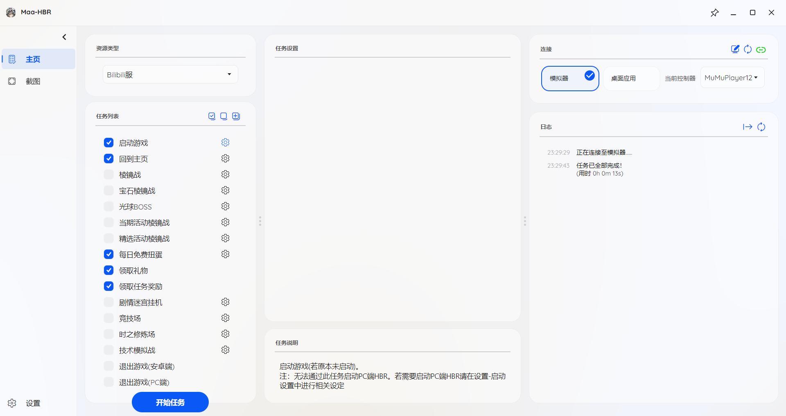

<!-- markdownlint-disable MD033 MD041 -->

  

# Maa-HBR

<!-- prettier-ignore-start -->
<!-- markdownlint-disable-next-line MD036 -->
基于Maa全新架构的HBR自动化小助手
<!-- prettier-ignore-end -->

## 简介

本项目使用图像识别+模拟控制，用于简化Heaven Burns Red/炽焰天穹/绯染天空/红烧天堂每日流程。

由 [MaaFramework](https://github.com/MaaAssistantArknights/MaaFramework) 和 [MFAWPF](https://github.com/SweetSmellFox/MFAWPF) 强力驱动

## 快速开始

下载[Releases](https://github.com/KarylDAZE/Maa-HBR/releases)最新发行版中所用平台对应的压缩包，解压后打开Maa-HBR.exe即可开始使用。

1. 勾选需要进行的任务，并用拖动的方式将任务按执行顺序排好。
2. 搜索并连接到自己的adb设备（模拟器）或Win32窗口，
3. 配置好MFA相关设置，如可以尝试使用多种屏幕捕获方式，选择截图时间相对较短的一种。
4. 启动任务

GUI界面：

## 注意事项
- 尽量保证模拟器截图时间不要太高，游戏资源加载和网络速度不能过慢，否则可能出现识别出错或超时。
- 尽可能从游戏未运行的状态，或者游戏主页开始启动任务，否则可能无法识别当期界面。
- 合理安排任务顺序（或者直接按默认顺序执行），如先清体力再领取任务奖励；最后运行竞技场/时之修炼场。
- 如需使用相应功能，请提前设置好战斗相关设置、时之修炼场挑战设定、不同战斗场合对应的队伍等。战斗方式仅支持auto，需要设置好AUTO-FULL方式下的攻击技能释放模式以及角色技能的自动配置，如：

## Q&A
- Q：为什么竞技场和时之修炼场需要在线挂机？
- A：竞技场和时之修炼场离线挂机的每场战斗耗时分别min(通关时间+20s,50s)和min(通关时间+20s,80s)，而在线挂机每场战斗的“额外消耗时间”（过场和加载时间）约为8s左右（如果设备和网络环境较差，耗时可能更长），即每场战斗耗时为通关时间+额外消耗时间=通关时间+8s，收益更高。

## TODO

- [ ] 每日免费抽卡
- [ ] 风格突破
- [ ] 自动炼金
- [ ] 光球boss
- [ ] 精选活动棱镜战
- [ ] 刷属性回廊
- [ ] 迷宫挂机

## 鸣谢

### 开源库

- [MaaFramework](https://github.com/MaaAssistantArknights/MaaFramework)  
基于图像识别的自动化黑盒测试框架
- [MFAWPF](https://github.com/SweetSmellFox/MFAWPF)  
  基于 MAA 全新架构的 通用 GUI。